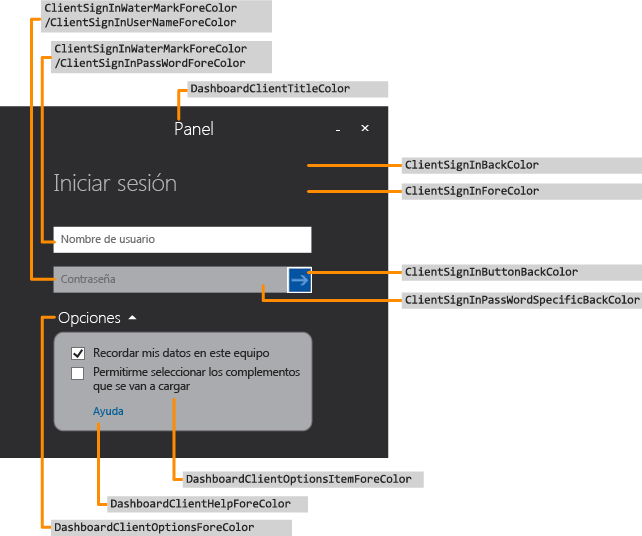
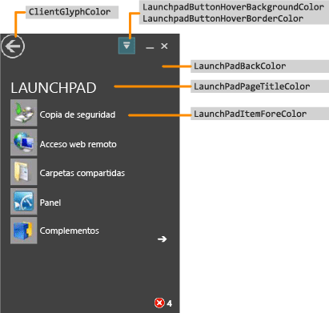
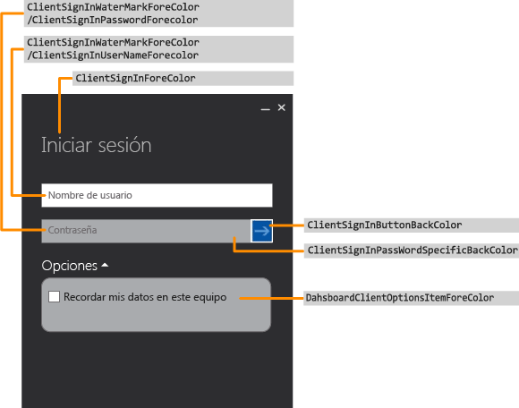
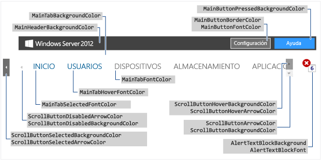
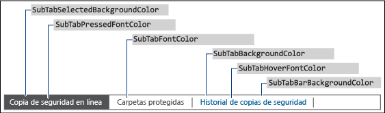
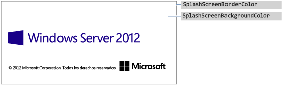
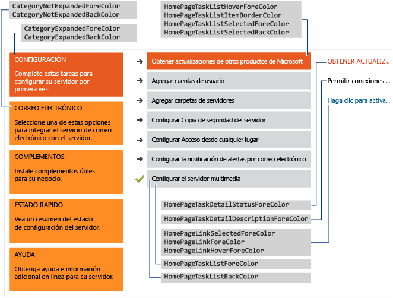

# <a name="change-the-color-scheme-of-the-dashboard-and-launchpad"></a>Cambiar la combinación de colores del panel y del Launchpad

>Se aplica a: Windows Server 2016 Essentials, Windows Server 2012 R2 Essentials, Windows Server 2012 Essentials

Puedes cambiar la combinación de colores del panel y del Launchpad definiendo los colores que quieres usar en un XML formato de archivo, instalar el archivo .xml en una carpeta en el servidor y especificando el nombre del archivo .xml en una entrada al registro.  
  
## <a name="create-the-xml-file"></a>Crear el archivo xml  
 El siguiente ejemplo muestra el posible contenido del archivo. XML:  
  
```xml  
<DashboardTheme xmlns="https://www.microsoft.com/HSBS/Dashboard/Branding/2010">  
  
  <!-- Hex color values overwriting default SKU theme colors -->  
  
    <SplashScreenBackgroundColor HexValue="FFFFFFFF"/>  
    <SplashScreenBorderColor HexValue="FF000000"/>  
    <MainHeaderBackgroundColor HexValue="FF414141"/>  
    <MainTabBackgroundColor HexValue="FFFFFFFF"/>  
    <MainTabFontColor HexValue="FF999999"/>  
    <MainTabHoverFontColor HexValue="FF0072BC"/>  
    <MainTabSelectedFontColor HexValue="FF0072BC"/>  
    <MainButtonPressedBackgroundColor HexValue="FF0072BC"/>  
    <MainButtonFontColor HexValue="FFFFFFFF"/>  
    <MainButtonBorderColor HexValue="FF6E6E6E"/>  
    <ScrollButtonBackgroundColor HexValue="FFF0F0F0"/>  
    <ScrollButtonArrowColor HexValue="FF999999"/>  
    <ScrollButtonHoverBackgroundColor HexValue="FF999999"/>  
    <ScrollButtonHoverArrowColor HexValue="FF6E6E6E"/>  
    <ScrollButtonSelectedBackgroundColor HexValue="FF6E6E6E"/>  
    <ScrollButtonSelectedArrowColor HexValue="FFFFFFFF"/>  
    <ScrollButtonDisabledBackgroundColor HexValue="FFF8F8F8"/>  
    <ScrollButtonDisabledArrowColor HexValue="FFCCCCCC"/>  
    <AlertTextBlockBackground HexValue="FFFFFFFF"/>  
    <AlertTextBlockFont HexValue="FF000000"/>  
    <FontColor HexValue="FF000000"/>  
    <SubTabBarBackgroundColor HexValue="FFFFFFFF"/>  
    <SubTabBackgroundColor HexValue="FFFFFFFF"/>  
    <SubTabSelectedBackgroundColor HexValue="FF414141"/>  
    <SubTabBorderColor HexValue="FF787878"/>  
    <SubTabFontColor HexValue="FF787878"/>  
    <SubTabHoverFontColor HexValue="FF0072BC"/>  
    <SubTabPressedFontColor HexValue="FFFFFFFF"/>  
    <ListViewColor HexValue="FFFFFFFF"/>  
    <PageBorderColor HexValue="FF999999"/>      
    <LaunchpadButtonHoverBorderColor HexValue="FF6BA0B4"/>  
    <LaunchpadButtonHoverBackgroundColor HexValue="FF41788F"/>  
    <ClientArrowColor HexValue="FFFFFFFF"/>  
    <ClientGlyphColor HexValue="FFFFFFFF"/>  
    <SplitterColor HexValue="FF83C6E2"/>  
    <HomePageBackColor     HexValue="FFFFFFFF"/>  
    <CategoryNotExpandedBackColor HexValue="FFFFB343"/>  
    <CategoryExpandedBackColor HexValue="FFF26522"/>  
    <CategoryNotExpandedForeColor HexValue="FF2A2A2A"/>  
    <CategoryExpandedForeColor HexValue="FFFFFFFF"/>  
    <HomePageTaskListForeColor    HexValue="FF2A2A2A"/>  
    <HomePageTaskListBackColor HexValue="FFEAEAEA"/>  
    <HomePageTaskListHoverForeColor      HexValue="FF2A2A2A"/>  
    <HomePageTaskListItemBorderColor     HexValue="FF999999"/>  
    <HomePageTaskListSelectedForeColor   HexValue="FFFFFFFF"/>  
    <HomePageTaskListSelectedBackColor   HexValue="FFF26522"/>  
    <HomePageTaskDetailStatusForeColor   HexValue="FFF26522"/>  
    <HomePageTaskDetailDescriptionForeColor     HexValue="FF2A2A2A"/>  
    <HomePageLinkForeColor HexValue="FF0072BC"/>  
    <HomePageLinkSelectedForeColor HexValue="FF0054A6"/>  
    <HomePageLinkHoverForeColor   HexValue="FF0072BC"/>  
    <PropertyFormForeColor HexValue="FF2A2A2A"/>  
    <PropertyFormTabHoverColor HexValue="FF0072BC"/>  
    <PropertyFormTabSelectedColor HexValue="FFFFFFFF"/>  
    <PropertyFormTabSelectedBackColor HexValue="FF414141"/>  
    <TaskPanelBackColor HexValue="FFFFFFFF"/>  
    <TaskPanelItemForeColor HexValue="FF2A2A2A"/>  
    <TaskPanelGroupTitleForeColor HexValue="FF2A2A2A"/>  
    <TaskPanelGroupTitleBackColor HexValue="FFCCCCCC"/>  
    <DashboardClientBackColor HexValue="FF004050"/>  
    <DashboardClientTitleColor HexValue="FFFFFFFF"/>  
    <DashboardClientOptionsForeColor HexValue="FFFFFFFF"/>  
    <DashboardClientOptionsItemForeColor HexValue="FF2A2A2A"/>  
    <DashboardClientHelpForeColor HexValue="FF0054A6"/>  
    <ClientSignInForeColor HexValue="FFFFFFFF"/>  
    <ClientSignInWaterMarkForeColor HexValue="FF999999"/>  
    <ClientSignInUserNameForeColor HexValue="FF2A2A2A"/>  
    <ClientSignInPassWordSpecificBackColor HexValue="FFCCCCCC"/>  
    <ClientSignInButtonBackColor HexValue="FF004050"/>  
    <ClientSignInPassWordForeColor HexValue="FF2A2A2A"/>  
    <LaunchPadBackColor HexValue="FF004050"/>  
    <LaunchPadPageTitleColor HexValue="FFFFFFFF"/>  
    <LaunchPadItemForeColor HexValue="FFFFFFFF"/>  
  <LaunchPadItemHoverColor HexValue="33FFFFFF"/>  
  <LaunchPadItemIconBackgroundColor HexValue="F2004050"/>  
</DashboardTheme >  
  
```  
  
> [!IMPORTANT]
>  Los elementos xml deben especificarse en el orden en que aparecen en el ejemplo anterior.  
  
> [!NOTE]
>  Todos los valores del atributo HexValue son ejemplos de valores hexadecimales para colores. Puede especificar cualquier valor de color hexadecimal que quieras usar.  
  
 Usar el Bloc de notas o Visual Studio 2010 para crear el archivo .xml que contiene las etiquetas para las áreas que deseas personalizar. Puedes dar cualquier nombre al archivo, pero debe tener una extensión .xml. Para obtener una descripción de las áreas que se pueden personalizar en el panel y del Launchpad, consulta [áreas panel y del Launchpad que se pueden cambiar](Change-the-Color-Scheme-of-the-Dashboard-and-Launchpad.md#BKMK_Dashboard).  
  
#### <a name="to-install-the-xml-file"></a>Para instalar el archivo .xml  
  
1.  En el servidor, mueve el mouse a la esquina superior derecha de la pantalla y haz clic en **búsqueda**.  
  
2.  En el cuadro de búsqueda, escriba **regedit**y, a continuación, haz clic en el **Regedit** aplicación.  
  
3.  En el panel izquierdo, expande **HKEY_LOCAL_MACHINE**, expanda **SOFTWARE**, expanda **Microsoft**, expanda **Windows Server**. Si la **OEM** clave no existe, debes completar los siguientes pasos para crearla:  
  
    1.  Haz clic en **Windows Server**, elija **nueva**y, a continuación, haz clic en **clave**.  
  
    2.  Tipo **OEM** para el nombre de la clave.  
  
4.  Haz clic en **OEM**, elija **nueva**y, a continuación, haz clic en **valor de cadena**.  
  
5.  ENTRAR **CustomColorScheme** como el nombre de la cadena y después presiona **ENTRAR**.  
  
6.  Haz clic en **CustomColorScheme** en el panel derecho y, a continuación, haz clic en **modificar**.  
  
7.  Escribe el nombre del archivo y, a continuación, haz clic en **Aceptar**.  
  
8.  Copia el archivo en %programFiles%\Windows Server\Bin\OEM. Si el directorio OEM no existe, Créalo.  
  
##  <a name="BKMK_Dashboard"></a>Áreas de panel y del Launchpad que se pueden cambiar  
 Esta sección incluye ejemplos de áreas panel y del Launchpad que se pueden personalizar.  
  
### <a name="examples"></a>Ejemplos  
  
####  <a name="BKMK_Figure1"></a>Figura 1: Página de inicio de sesión del panel  
   
  
####  <a name="BKMK_Figure2"></a>Figura 2: Launchpad  
   
  
####  <a name="BKMK_Figure3"></a>Figura 3: Página de inicio de sesión del Launchpad  
   
  
####  <a name="BKMK_Figure4"></a>Figura 4: Texto del panel  
   
  
####  <a name="BKMK_Figure5"></a>Figura 5: Borde de la subpestaña  
   
  
####  <a name="BKMK_Figure6"></a>Figura 6: Panel de tareas  
   
  
####  <a name="BKMK_Figure9"></a>Figura 7a: pantalla de presentación de producto  
   
  
#### <a name="figure-7b-home-page"></a>Figura 7b: página principal  
   
  
## <a name="see-also"></a>Consulta también  
 [Crear y personalizar la imagen](Creating-and-Customizing-the-Image.md)   
 [Personalizaciones adicionales](Additional-Customizations.md)   
 [Preparación de la imagen para la implementación](Preparing-the-Image-for-Deployment.md)   
 [Prueba la experiencia del cliente](Testing-the-Customer-Experience.md)